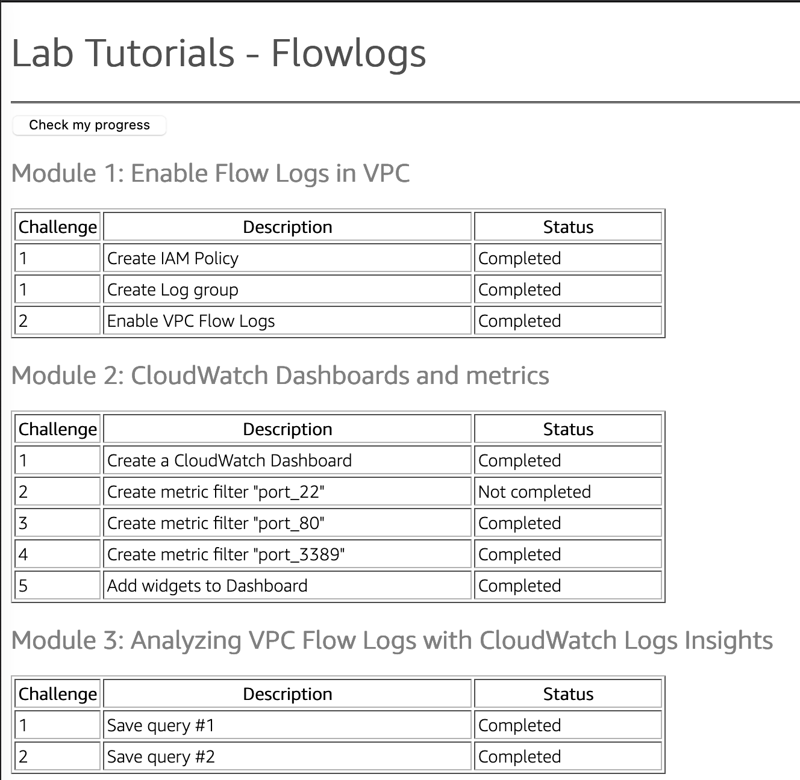

+++ 
title = "Lab tutorials - Flow Logs" 
chapter = true 
weight = 1 
+++

## 
Lab tutorials - Flow Logs

{}

**Work in progress**

1. Student IAM policy

1. Improve IAM policies permissions deployed in CloudFormation

1. Improve visuals in challenge validation web site

1. Overall instructions narrative text, this is a *minimum viable product*

Validation web site screenshot:

