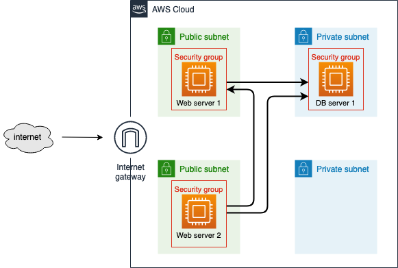
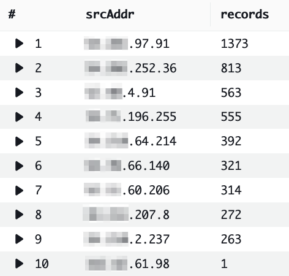
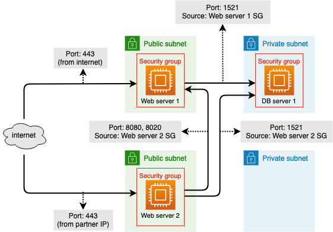

+++
title = "Lab Tutorials - Flow Logs challenges"
weight = 1
chapter = false
pre = "<b>1. </b>"
+++

## VPC Flow Logs Service description

[narrative]

This is the initial diagram



In this Lab tutorials lab environment you will be asked to complete 13 different challenges, the validation web site will confirm you once the challenges are completed.

To complete the challenge, in a few cases we will give you a walkthrough, but for the most of them you will not be provided with a step-by-step guide, instead, you will be provided with hints and documentation references to perform those challenges.

Go to Cloudformation Outputs tab and copy the following outputs, you will need them thru the challenge activities.

  * Validation web server Public IP

  * Web server 1 private IP

  * Web server 2 private IP

  * Partner server Public IP

    {}
  This parameters (IPs) will be published as "outputs" in AWS Labs, there would not be need to pick them up from CloudFormation *outputs* tab
  {}

In a separate browser open the Lab Tutorial validation web site, use the *Validation web server Public IP* paramenter from the Cloudformation Outputs

### Module 1: Enable Flow Logs in VPC

In this first module you will perform activities to enable the VPC Flow Logs service

Create a VPC Flow Log that will **pubish logs to CloudWatch Logs**. Prior to complete this task, you will need to create some services:

  * IAM policy and role. Please name your role `vpc-flow-logs-role` to validate the challenge.

    Reference: https://docs.aws.amazon.com/vpc/latest/userguide/flow-logs-cwl.html#flow-logs-iam

  * CloudWatch Logs log group. Please name you log group `flowlogs` to validate the challenge.

    Reference: https://docs.aws.amazon.com/AmazonCloudWatch/latest/logs/Working-with-log-groups-and-streams.html

Create a VPC Flow Logs on the VPC called `VPC-Lab-Flowlogs`.

Use the below Flow log settings (some settings were ommited deliberately):

| Key | Value  |
|---|---|
| Name  | lab-tutorials |
| Filter  | All |
| Maximum aggregation interval | 1 minute |
| Log record format  | AWS default format |

<br>

**Module 1 Challenges:**

| Challenge | Description  |
|---|---|
| 1 | Create IAM Policy  |
| 2 | Create Log group  |
| 3 | Enable VPC Flow Logs |

As soon as the VPC Flow log is created the challenge will be validated.

### Module 2: Create CloudWatch metric filter for a flow log

To better visualize and understand network traffic we will now create a CloudWatch Dashboard. Please name it `Flow-Logs`. Do not add graphs at this point, we will add widgets in the steps ahead.

Reference: https://docs.aws.amazon.com/AmazonCloudWatch/latest/monitoring/create_dashboard.html

An important feature of Flow Logs is the integration with CloudWatch metrics and alarms, so an administrator could get notified when something abnormal is occurring in the environment.

In this task you will create 3 different metrics, trying to identify malicious network activity in the VPC. Specifically incoming traffic on ports 22, 80 and 3389.

This is the walkthough to create a CloudWatch filter

Navigate to the CloudWatch console

Click on **Log groups**

Mark the checkbox next to the Flow Logs group you created in Task #1 (do not click on the Flow Log group name)

Click on **Actions** -> **Create metric fiter**

Below **Filter pattern** paste the below *string* and hit **Enter**

```sh
[version, account, eni, source, destination, srcport, destport="22", protocol="6", packets, bytes, windowstart, windowend, action, flowlogstatus]
```

This string will filter flow logs targeting incoming traffic on port **22** (destport="22") and protocol **TCP** (protocol="6")

Click on **Next**

In the **Assign metric** step complete the following fields:

| Key | Value  |
|---|---|
| Filter name  | port_22 |
| Metric namespace  | flowlogs |
| Metric name | port_22 |
| Metric value  | 1 |
| Unit – optional  | Count |
| 1st Dimension Name  | ENI |
| 1st Dimension Value  | $eni |
| 2nd Dimension Name  | ACTION |
| 2nd Dimension Value  | $action |

<br>

Click on **Next**

Click on **Create metric filter**

Reference: https://docs.aws.amazon.com/vpc/latest/userguide/flow-logs-cwl.html#process-records-cwl

You will create two additional metric filters, one filtering port `80` (HTTP) and the second one filtering port `3389` (RDP). These are commonly known as vulnerable ports when exposed in the internet.

For the **Metric name** and **Filter name** please use this pattern: **port_`##`**.

Use the following filters configuration for both filters:

| Key | Value  |
|---|---|
| Metric namespace  | flowlogs |
| Metric value  | 1 |
| Unit – optional  | Count |
| 1st Dimension Name  | ENI |
| 1st Dimension Value  | $eni |
| 2nd Dimension Name  | ACTION |
| 2nd Dimension Value  | $action |

<br>

Now navigate to CloudWatch Metrics and explore the metric you just created in the Custom Namespace **flowlogs**

Click on the Namespace **flowlogs** (under *Custom Namespaces*), then click on **ACTION, ENI**. You now will see a list of different metrics, per **ENIs** (*Elastic network interface*) and per **Metric Name**.

In this challenge you will create 3 graphs and add them to the CloudWatch Dashboard you have created in a previous step. Here's the walkthrough to create the first graph (PORT 22).

Navigate to CloudWatch **Metrics**

Below **Custom namespaces**, click on **flowlogs**

Click on **ACTION, ENI**

You must see a list of metrics (one of the ENIs listed is the NAT Gateway's), mark the checkbox next to the metrics which metric name is **port_22**.

Notice all values in the **ACTION** column are **ACCEPT**

Click on **Graphed metrics** tab

Change the **Statistic** and **Period** parameters

| Key | Value  |
|---|---|
| Statistic | Sum  |
| Period  | 1 Minute |

<br>

Click on the *pencil* next to *Untitled graph* and type **Port 22 - ACCEPT**, hit **Enter**

Click **Actions** and select **Add to dashboard**

Select the *existing* Dashboard **Flow-Logs** you have already created, leave the rest parameters as *defaut* and click **Add to dashboard**.

Your graph (or *widget*) has beed added to the Dashboard, click on **Save dashboard**

Note: you could resize the widget and change the data time span to **1h** for better visualization, remember to save you Dashboard changes.

Now, you will repeat the process for the **port_80** and **port_3389** metric filters.

Once you have added the three widgets to your Dashboard, challenge will be marked as completed

**Module 2 Challenges:**

| Challenge | Description  |
|---|---|
| 1 | Create a CloudWatch Dashboard  |
| 2 | Create metric filter "port_22"  |
| 3 | Create metric filter "port_80" |
| 4 | Create metric filter "port_3389" |
| 5 | Add widgets to Dashboard |

### Task 3: Analyzing VPC Flow Logs with CloudWatch Logs Insights

CloudWatch Logs Insights enables you to interactively search and analyze your log data in Amazon CloudWatch Logs. You can perform queries to help you more efficiently and effectively respond to operational issues. If an issue occurs, you can use CloudWatch Logs Insights to identify potential causes and validate deployed fixes.

CloudWatch Logs Insights automatically discovers fields in logs from AWS services such as Amazon Route 53, AWS Lambda, AWS CloudTrail, and Amazon VPC, and any application or custom log that emits log events as JSON.

CloudWatch Logs Insights include by default the following discovered log fields for VPC Flow Logs:

* @timestamp
* @logStream
* @message
* accountId
* endTime
* interfaceId
* logStatus
* startTime
* version
* action
* bytes
* dstAddr
* dstPort
* packets
* protocol
* srcAddr
* srcPort

Navigate to CloudWatch -> Logs -> Insights

We're going to use this service to query our Flow log to find out the numbers of incoming traffic records the web-server-1 is receiving per port.

In *Select log group(s)*, display the combo options and select the check box next to **flowlogs**

In the query window, paste the below SQL query command. Subtitute "xxx.xxx.xxx.xxx" with the actual web-server-1 *private* IP.

```sql
filter dstAddr="xxx.xxx.xxx.xxx" 
| stats count(*) as records by dstPort
| sort records desc 
| limit 10
```

Click on **Run query**

Log Insights allow to save queries to run it at a later time, on demand.

We are going to save this query, click on **Save**

On **Query name** type "top-incoming-records-per-port-webserver-1".

Leave the rest of the paramenters as default,and click on **Save**

Now you will run another SQL script, this time you will query the top incoming records on port 80, to Web server 2 and sorted by source IP.

Hint 1: the query will count the number of records and group them by srcAddr

Hint 2: The first filter must be the port filter to validate the challenge

You must see a similar output in the log result window:



```sql
filter dstPort="80" 
| filter dstAddr="xxx.xxx.xxx.xxx"
| stats count(*) as records by srcAddr
| sort records desc 
| limit 10
```

  {}
QUERY SCRIPT TO BE REMOVED, I'M LEAVING IT HERE FOR REFERENCE
{}


Once you have figured the SQL script out, click on **Actions** and select **Save as**. Please name it as `top-incoming-records-by-source-on-port-80`.

**Module 3 Challenges:**

| Challenge | Description  |
|---|---|
| 1 | Save query #1 |
| 2 | Save query #2 |

As soon as you save que query, the task will be validated.

### Task 4: Identify and remediate over permissive firewall rules in Security Groups

To protect the instances from potentially malicious traffic you could use VPC Security Grups, in this challenge you must remediate the ones associated with the 3 instances provisioned in this lab environment.

Take a look at the network diagram



Analize the EC2 instances associated Security Groups and modify the firewall rules to make your environment more secure

Modify the Web server 1 Security Group inbound rules:

| Type | Port range  | Source |
|---|---|---|
| HTTPS  | 443  | 0.0.0.0/0 |
| Custom TCP  | 8020 | Web server 2 security group ID |
| Custom TCP  | 8080 | Web server 2 security group ID |

<br>

Now please update the Web server 2 and DB server Security Groups according to the network diagram.

Hint: https://docs.aws.amazon.com/vpc/latest/userguide/VPC_SecurityGroups.html#SecurityGroupRules

Reference: https://docs.aws.amazon.com/AWSEC2/latest/UserGuide/security-group-rules-reference.html

A few minutes after you made the updates in the security groups you will see a change in the CloudWatch dashboard you have created. A significant reduction in the number of incoming log records to the instances and an increase in the rejected flow logs records.

**Module 4 Challenges:**

| Challenge | Description  |
|---|---|
| 1 | Update Web server 1 security group |
| 2 | Update Web server 2 security group |
| 3 | Update DB server 1 security group |

Challenge status will be updated as completed as soon as you update the security group incoming rules.

Congratulations!